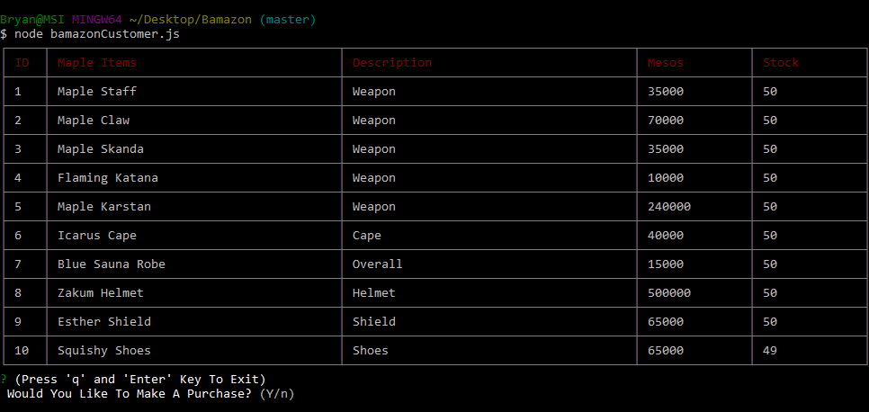
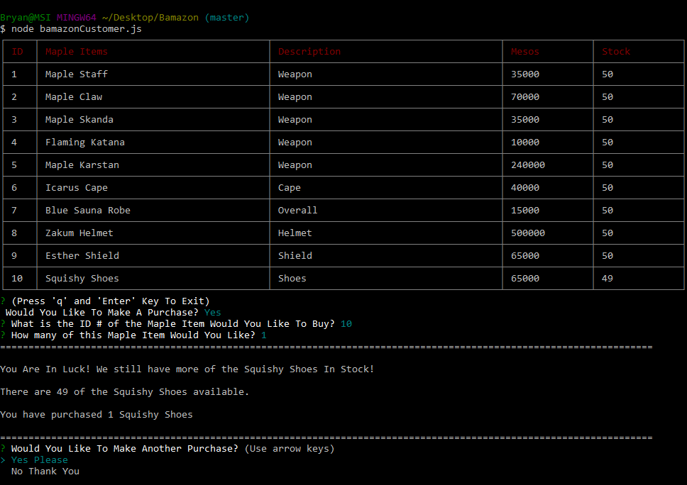
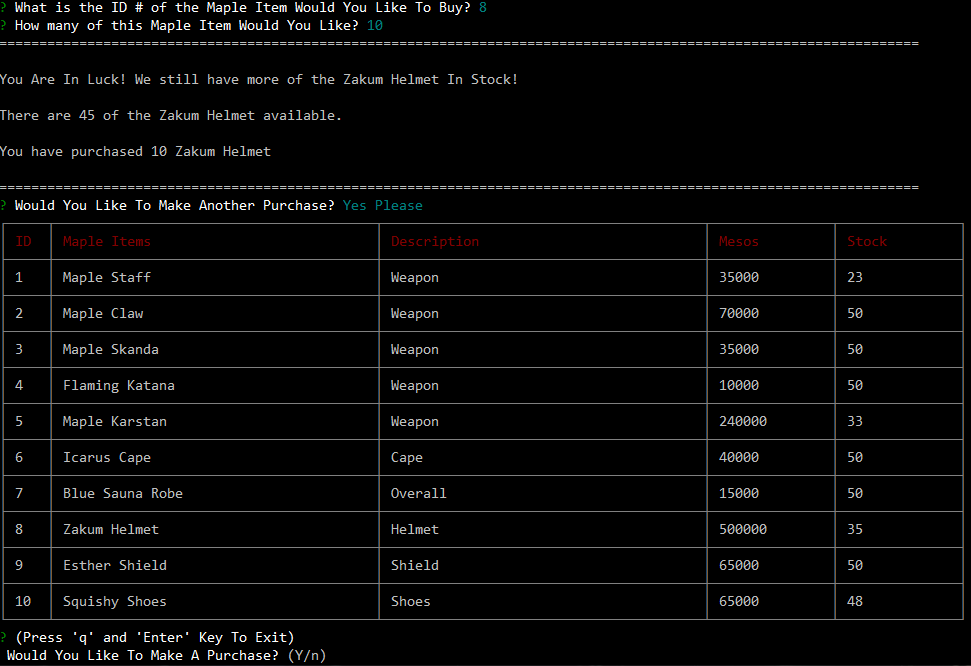
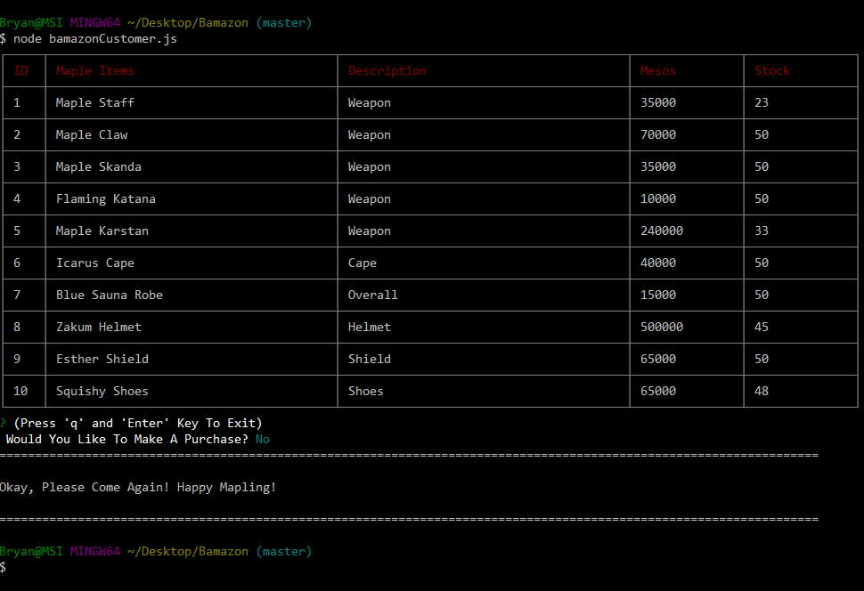

# Bamazon 

### Links: 

Github: <br>
https://github.com/bryanjacinto1994/Bamazon

<hr>
<br>

## Tools Used:

* Visual Studio Code - Open source code editor for building and debugging web and cloud applications.
* JavaScript - A scripting language that uses curly-bracket syntax, first class functions and object-oriented.
* jQuery - A JavaScript library that simplifys to manipulate HTML DOM.
* Git - Version control system to track changes to source code.
* Github - Hosts respository that can be deployed to GitHub pages.
* NodeJS - A JavaScript runtime built on Chrome's V8 JavaScript engine
<br>

### NPM Packages Used:

* Inquirer
* MySQL
* Cli-Table


<hr>

## Get Started :
* Run Terminal/Git Bash.
* Do an npm install on these following packages:<br>
##### * Inquirer
##### * MySQL
##### * Cli-Table

#### (The Summary Section Will Explain How To Do A Proper Installation On These NPM Packages)
* Go into the files where the javascript file is located. <br>
Run on the Terminal / Gitbash<br>
### node bamazonCustomer.js
* Your screen should now look like the picture below:
<br> The screen should ask the user if you would like to make a purchase.
 
 <br> <br> <hr>

* If you typed "yes", it should now look like the picture below:
* It will now ask the user what ID number of the item they would like to purchase and the quantity of that specific item id.<br> 


 <br> <br> <hr>

* After making a purchase, it will ask the user if they would like to make another purchase. If yes, the table appears again to choose from the following options.

 <br> <br> <hr>

* If the user does not want to make another purchase, the screenshot below will give you the following message:

 <br>

<hr>


## Summary

Using JavaScript and all the NPM packages listed above via Visual Studio Code, a mocked up version of "Amazon" was created through Node.js.

The process of creating this program is to install the following npm packages in order for the program to completely work. 

By making a connection to my sql using "mysql.createConnection", this will grab the mysql database from the '.sql' file located in your folder. 

I have made a function that will view the information from MySQL database onto the node.js Terminal/ Git Bash and displays as a nice formatted table.

Inquirer Prompt function was used to ask the user questions. Upon asking the questions, there are if/else statements depending on what the user chooses. If the user chooses to purchase, it will go to a new question prompt function. If not, it will give an 'else' statement, and a message will show up.

For the NPM Packages (listed above), this was used to have access to use the "inquirer prompt" command to ask questions to the users. "MySQL" npm package is used to have access to the '.sql' files and also connected from the MySQL WorkBench. Lastly, the "Cli-Table" is used to have a nice format of the table in the Terminal/Git Bash <br><br>

```javascript
var inquirer = require('inquirer');
var mysql = require('mysql');
var cliTable = require("cli-table");
```
How to install the npm packages:
* #### Inquirer : <br><br>$ npm install inquirer
* #### MySQL :<br><br> $ npm install mysql
* #### Cli - Table : <br><br>$ npm install cli-table


<hr>


## Code Snippet

bamazonCustomer.js : <br>
* This will create a nice formatted table display on the Terminal/Git Bash.
<br> 

```javascript

//======================================== [Table] ========================================//
function viewTable(){
    
    //Grabbing all the table information from bamazon.sql file.
    connection.query('SELECT * FROM products', function(err, res){
        if(err) throw err;
    
    //This will create a nice formatted table with header subjects.
        var viewItems = new cliTable({
            head: ["ID", "Maple Items", "Description", "Mesos", "Stock"],
    //These are the column sizes. Play around with the numbers so the text will appear visibly.
            colWidths: [5, 40, 40, 15, 15]
        });
    
    //For loop function to push the VALUES from bamazon.sql on to the table.
        for(var i = 0; i < res.length; i++){
            viewItems.push([
                res[i].id,
                res[i].item_name,
                res[i].department_name,
                res[i].price,
                res[i].stock_quantity
            ]);
        }
    //This function will display the table onto the Terminal/Gitbash. Using "toString() will format the table nicely instead of arrays."
        console.log(viewItems.toString());
    
        //This executes the question prompt.
     questions()
    })
    
}
    
```
<br><hr><br>
bamazonCustomer.js :<br>
* This function contains a prompt that asks the user the following questions. If the user chooses to purchase, it will go to a new function that asks the next question. If not, it will show the user a message.
<br>

```javascript


function questions(){

    //Gives the user a choice if they would like to make a purchase.
    inquirer.prompt([
      
        {
            name: "confirm",
            type: "confirm",
            message:"(Press 'q' and 'Enter' Key To Exit) \n Would You Like To Make A Purchase?"
        }
        
    ]).then(function(answer){

        //If the user wants to make a purchase, the if statement will run and calls the next question prompt function.
        
        if(answer.confirm === true){
            questionTwo();
        }
        //If the user DOES NOT WANT TO make a purchase, a message will appear on the screen and the program will automatically exit using "process.exit()".
        else{
            console.log("===================================================================================================================")
            console.log("\nOkay, Please Come Again! Happy Mapling!\n");
            console.log("===================================================================================================================")
            process.exit();
        }

        //This if statement will give the user a choice to close the program if they typed 'q' on the screen and press "Enter" key.
        var confirm = answer.confirm;
        if(confirm === "q"){
            process.exit();
        }

    });
   
}
```
<br><hr><br>
bamazonCustomer.js:<br>

* This function executes if the user wants to purchase an item. Then it will ask the following questions. Once the user purchases an item, the quantity of the item gets updated. If there are no more of the specific item on stock, it will give an else statement saying "Insfficient Quantity".<br>
Once the user finish making a purchase, it will ask the user if they would like to make another purchase.
<br>

```javascript

//======================================== [Next Question Prompt] ========================================//

//This function will execute if the user wants to make a purchase: From "questions()"
function questionTwo(){
   
   //The following prompt will ask the user the ID # of the item they would like to purchase.
   
    inquirer.prompt([
        {
            name: "id",
            type: "input",
            message: "What is the ID # of the Maple Item Would You Like To Buy?",
            validate: function(val){
                if(isNaN(val) === false){
                    return true;
                }
                else{
                    return false;
                }
            }
        },
        {
    //Then, it will ask the user how many of that specific ID item they would like to purchase.
            name: "howMany",
            type: "input",
            message: "How many of this Maple Item Would You Like?",
            validate: function(val){
                if(isNaN(val) === false){
                    return true;
                }
                else{
                    return false;
                }
            }
        }
    ])
    .then(function(answer){
        // var id = answer.id;
        // var howMany = answer.howMany;
        //     if(id === "q"){
        //         process.exit();
        //     }
        //     else if(howMany === "q"){
        //         process.exit();
        //     }

        //This variable item_id will hold the name from the prompt above:
        var item_id = answer.id;
        connection.query("SELECT * FROM products WHERE ?", [{id: item_id}], function(err, res){
            
            if(err) throw err;

            //If / Else statement that will subtract the current quantity from the user's quantity purchases.
            if(res[0].stock_quantity - answer.howMany >= 0){

                console.log("===================================================================================================================")
                //If the item is in stock, this message below will appear on the screen showing that there are more of that specific item on stock.
                console.log("\nYou Are In Luck! We still have more of the " + res[0].item_name + " In Stock!\n");
                //This displays how many are in stock left of the specific item the user chooses to purchase.
                console.log('There are ' + res[0].stock_quantity + " of the " + res[0].item_name + " available.\n");
                //This displays how many of the specific item the user purchased.
                console.log("You have purchased " + answer.howMany + " " +  res[0].item_name + "\n");
                console.log("===================================================================================================================")
                
                //This will update the stock quantity once making a purchase.
                connection.query('UPDATE products SET stock_quantity=? WHERE id=?',
                [res[0].stock_quantity - answer.howMany, item_id], function(err){
                    if(err) throw err;

                    //This function will be called to ask the user if they would like to make another purchase.
                    purchaseMore();
                })
            }
            //If there are no more of the item in stock, "Insufficient Quantity" message will appear and shows how many of the item are avaiable(0).
            else{
                console.log("===================================================================================================================")
                console.log('\nInsufficient Quantity.\n')
                console.log("There are  " + res[0].stock_quantity + " of the " + res[0].item_name + " available.\n")
                console.log("===================================================================================================================")
                //This function will be called to ask the user if they would like to make another purchase.
                purchaseMore();
            }
           
        })
       
    })
}

```
<br><hr><br>
bamazonCustomer.js:<br>

This function will be called out after the user makes the first purchase. It will ask if they would like to make another purchase. If yes, the table function will execute again. If not, it will show the else statement with the following messages: <br> 


### console.log("I Completely Understand.")
### console.log("Farewell And Have A Safe Travel, Fellow Mapler!") 


```javascript

//======================================== [Purchase Items Again] ========================================//
function purchaseMore(){
    
    //Prompt questions using type: "list" to give user a choice to answer "Yes" or "No".
    inquirer.prompt([
        {
            name: "purchase",
            type: "list",
            message: "Would You Like To Make Another Purchase?",
            choices: ['Yes Please', 'No Thank You']
        }
    ])
    .then(function(action){
        
        //If / Else Statement if the user chooses "Yes", it will execute the viewTable() function again.
        var purchase = action.purchase;
        if(purchase === 'Yes Please'){
            
            viewTable();
            
        }
        //If the user does not want to make another purchase, a message will appear and the program will automatically exit using "process.exit".
        else{
            console.log("===================================================================================================================")
            console.log("\nI Completely Understand.\n")
            console.log("Farewell And Have A Safe Travel, Fellow Mapler!\n")
            console.log("===================================================================================================================")
            process.exit();
        }
    })
}

```


## Author Links
Linkedin:<br>
https://www.linkedin.com/in/bryan-jacinto-100438aa/

Github:<br>
https://github.com/bryanjacinto1994
